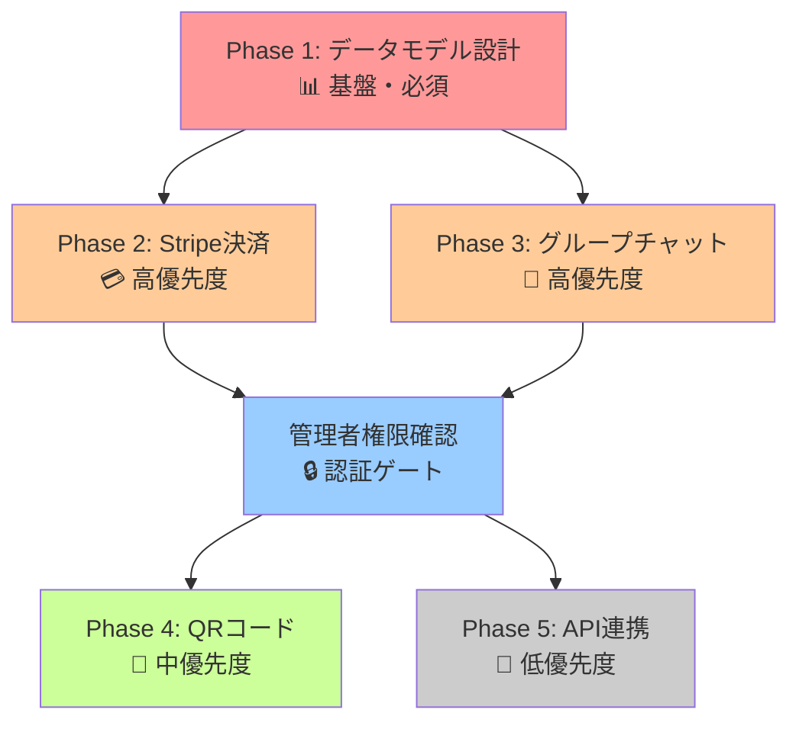

# 開発戦略: 並行 vs 順次開発の分析

## 🎯 結論: **ハイブリッド戦略**を推奨

完全な並行開発でも完全な順次開発でもなく、**段階的並行開発**が最適です。

---

## 📊 依存関係分析

### 🔗 フェーズ間の依存関係



### 📋 依存関係の詳細

| フェーズ | 依存先  | 理由                           | 並行可能性      |
| -------- | ------- | ------------------------------ | --------------- |
| Phase 1  | なし    | データベース基盤               | ❌ (最優先)     |
| Phase 2  | Phase 1 | サブスクリプションテーブル必要 | ✅ (Phase 1 後) |
| Phase 3  | Phase 1 | グループテーブル必要           | ✅ (Phase 1 後) |
| Phase 4  | Phase 3 | グループ機能が前提             | ❌ (Phase 3 後) |
| Phase 5  | Phase 1 | ユーザーモデル拡張のみ         | ✅ (Phase 1 後) |

---

## 🚀 **推奨戦略: 段階的並行開発**

### 🎯 ステージ 1: 基盤構築（1 週目）

```
Phase 1: データモデル設計
├── ✅ 順次実行（単独）
├── ⏱️ 2-3日で完了
└── 🎯 全体の基盤となるため最優先
```

### 🎯 ステージ 2: 主要機能並行開発（2-3 週目）

```
Phase 2: Stripe決済 + Phase 3: グループチャット
├── ✅ 並行実行可能
├── ⏱️ 同時期に開発（3-7日）
├── 🔄 定期的な統合テスト
└── 🎯 コア機能を効率的に構築
```

### 🎯 ステージ 3: 拡張機能順次開発（4-5 週目）

```
Phase 4: QRコード → Phase 5: API連携
├── ✅ 順次実行
├── ⏱️ Phase 4完了後にPhase 5
└── 🎯 リスク最小化でリリース準備
```

---

## ⚖️ 並行 vs 順次開発の比較

### 🔄 **並行開発の場合**

#### ✅ メリット

- **開発期間短縮**: 2-3 週間の短縮効果
- **リソース効率**: 複数 AI エージェントの並列活用
- **早期ユーザーフィードバック**: コア機能の早期提供

#### ❌ デメリット

- **統合リスク**: マージコンフリクトの可能性
- **デバッグ複雑化**: 問題発生時の原因特定困難
- **品質リスク**: 十分なテスト期間の不足

### 📈 **順次開発の場合**

#### ✅ メリット

- **品質保証**: 各フェーズで十分なテスト
- **安定性**: 既存機能への影響最小化
- **問題の早期発見**: 段階的な品質確認

#### ❌ デメリット

- **開発期間延長**: 4-6 週間の延長
- **リソース効率低下**: AI エージェントの待機時間
- **市場投入遅延**: 競合優位性の低下

---

## 🎯 **推奨実行プラン**

### 📅 **Week 1: Phase 1 単独実行**

```bash
# Backend & Frontend並行
Backend:  feat/phase1-database-schema
Frontend: feat/phase1-user-model

目標: データベース基盤とユーザーモデル拡張完了
品質: 100%マイグレーション成功 + モデルテスト
```

### 📅 **Week 2-3: Phase 2 & 3 並行実行**

```bash
# 複数AIエージェント活用
Backend:  feat/phase2-stripe + feat/phase3-group-api
Frontend: feat/phase2-pricing + feat/phase3-admin-ui

統合: 毎日統合テスト実施
品質: 決済フロー + グループ機能の動作確認
```

### 📅 **Week 4: Phase 4 単独実行**

```bash
# QRコード機能集中開発
Backend:  feat/phase4-qr-backend
Frontend: feat/phase4-qr-frontend

品質: QRコード生成・参加フローの完全動作
```

### 📅 **Week 5: Phase 5 + 統合**

```bash
# API連携 + 最終統合
Backend:  feat/phase5-external-auth
Frontend: feat/phase5-auth-integration

最終: 全機能統合テスト + 本番デプロイ準備
```

---

## 🔧 **技術的リスク管理**

### 🛡️ **コンフリクト防止策**

#### 1. ファイル分離戦略

```typescript
// Backend: 明確なファイル分離
Phase 2: app/Http/Controllers/Stripe/
Phase 3: app/Http/Controllers/Group/

// Frontend: ページベース分離
Phase 2: pages/pricing/, composables/useStripe.ts
Phase 3: pages/admin/, composables/useGroups.ts
```

#### 2. データベース安全管理

```bash
# マイグレーション番号管理
Phase 2: 2025_02_*_stripe_*.php
Phase 3: 2025_03_*_group_*.php

# 段階的マイグレーション実行
php artisan migrate --path=/database/migrations/phase2
php artisan migrate --path=/database/migrations/phase3
```

### 🧪 **品質保証プロセス**

#### 1. 統合テスト頻度

- **Daily Integration**: 並行開発期間中は毎日
- **Feature Testing**: 各 Phase 完了時の機能テスト
- **E2E Testing**: ステージ完了時の総合テスト

#### 2. 監視ポイント

```typescript
// 重要な監視項目
- データベーステーブル整合性
- API エンドポイントの競合
- 認証・認可ロジックの一貫性
- UIコンポーネントの重複・競合
```

---

## 📈 **成功指標とマイルストーン**

### 🎯 **ステージ 1 完了条件**

- [ ] 全マイグレーション正常実行
- [ ] モデルリレーション動作確認
- [ ] 基本的な CRUD 操作成功

### 🎯 **ステージ 2 完了条件**

- [ ] Stripe 決済フロー動作（テストモード）
- [ ] グループ作成・管理機能動作
- [ ] 管理者ダッシュボード基本機能

### 🎯 **最終完了条件**

- [ ] 全機能の統合動作確認
- [ ] セキュリティテスト完了
- [ ] パフォーマンステスト合格
- [ ] 本番環境デプロイ成功

---

## 🚨 **緊急時の対応策**

### 🔥 **統合問題発生時**

1. **即座にロールバック**: 安定版ブランチに復帰
2. **問題の切り分け**: 個別フェーズでの動作確認
3. **段階的マージ**: 問題のないフェーズから順次統合

### ⚠️ **品質問題発生時**

1. **開発一時停止**: 品質確保を最優先
2. **根本原因分析**: 設計レベルからの見直し
3. **改善策実装**: 再発防止策の導入

---

## 🎪 **推奨採用戦略**

**段階的並行開発**により：

✅ **開発効率**: 2-3 週間の短縮
✅ **品質保証**: 段階的テストによる安定性
✅ **リスク管理**: 統合問題の早期発見・対応
✅ **柔軟性**: 問題発生時の迅速な方針転換

この戦略により、**効率性と安全性のバランス**を取りながら、高品質なサービスを迅速に市場投入できます。
