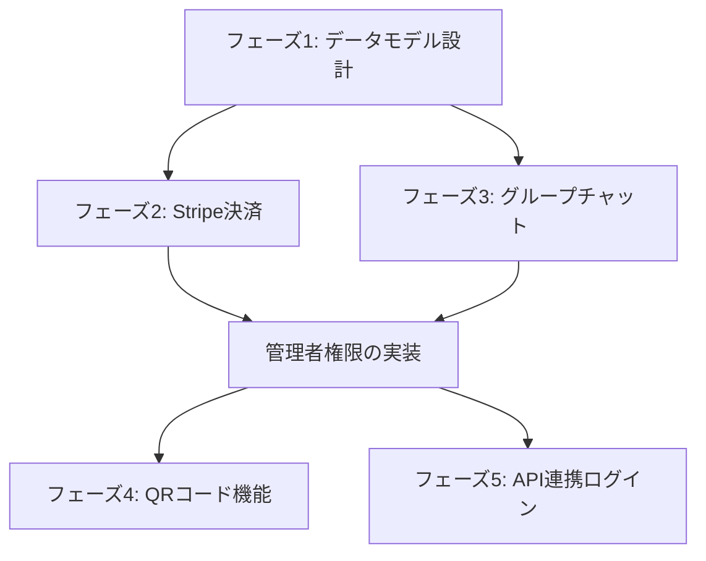

# 1 対多数チャットサービス有料化機能 実装計画書

## プロジェクト概要

既存のチャットアプリケーションに、有料の 1 対多数チャットサービス機能を追加する。管理者（有料会員）が複数の参加者とチャットできる機能を実装し、Stripe による課金システムを統合する。

## 技術スタック

- フロントエンド: Nuxt 3, Vue 3, TypeScript, Tailwind CSS, Pinia
- バックエンド: 独自 API（Laravel 想定）
- 認証: Laravel Sanctum
- 決済: Stripe
- リアルタイム通信: 要検討（WebSocket/Pusher/Firebase 等）

## 実装フェーズ

### フェーズ 1: データモデル設計と基盤整備（優先度: 高）

#### 1.1 データベース設計

**担当: バックエンドエンジニア**

```sql
-- 新規テーブル
groups (
  id: bigint primary key,
  owner_user_id: bigint foreign key,
  name: varchar(255),
  description: text,
  max_members: int,
  qr_code_token: varchar(255) unique,
  created_at: timestamp,
  updated_at: timestamp
)

group_members (
  id: bigint primary key,
  group_id: bigint foreign key,
  user_id: bigint foreign key nullable, -- QRコード参加者はnull可
  guest_identifier: varchar(255) nullable, -- ゲスト用識別子
  nickname: varchar(255),
  joined_at: timestamp,
  is_active: boolean
)

subscriptions (
  id: bigint primary key,
  user_id: bigint foreign key,
  stripe_subscription_id: varchar(255),
  stripe_customer_id: varchar(255),
  plan: enum('standard', 'premium'),
  status: enum('active', 'canceled', 'past_due', ...),
  current_period_end: timestamp,
  created_at: timestamp,
  updated_at: timestamp
)

group_messages (
  id: bigint primary key,
  group_id: bigint foreign key,
  sender_user_id: bigint foreign key,
  message: text,
  target_type: enum('all', 'specific_members', 'subgroup'),
  target_ids: json nullable, -- 特定メンバーやサブグループのID
  created_at: timestamp
)
```

#### 1.2 ユーザーモデル拡張

**担当: フロントエンド/バックエンドエンジニア**

- `frontend/stores/auth.ts` の User インターフェースに追加 ✅
  - plan: "free" | "standard" | "premium"
  - subscription_status: string
- バックエンドの User モデルも同様に拡張

### フェーズ 2: Stripe 決済機能実装（優先度: 高）

#### 2.1 Stripe 設定

**担当: バックエンドエンジニア**

- Stripe ダッシュボードで商品・価格設定
  - Standard Plan: ¥X,XXX/月（最大 50 名）
  - Premium Plan: ¥Y,YYY/月（最大 200 名）
- 環境変数設定
  ```env
  STRIPE_SECRET_KEY=sk_...
  STRIPE_WEBHOOK_SECRET=whsec_...
  STRIPE_PUBLISHABLE_KEY=pk_...
  ```

#### 2.2 決済 API エンドポイント作成

**担当: バックエンドエンジニア**

```typescript
// frontend/server/api/stripe/create-checkout-session.post.ts
export default defineEventHandler(async (event) => {
  // 1. 認証確認
  // 2. プランとユーザー情報取得
  // 3. Stripe Checkout Session作成
  // 4. セッションURLを返す
});

// frontend/server/api/stripe/webhook.post.ts
export default defineEventHandler(async (event) => {
  // 1. Stripe署名検証
  // 2. イベントタイプ別処理
  //    - checkout.session.completed
  //    - customer.subscription.updated
  //    - customer.subscription.deleted
  // 3. データベース更新
});
```

#### 2.3 課金ページ UI 実装

**担当: フロントエンドエンジニア**

```vue
<!-- frontend/pages/pricing.vue -->
<template>
  <div class="pricing-page">
    <!-- プラン一覧表示 -->
    <!-- 選択ボタン → Stripe Checkoutへリダイレクト -->
  </div>
</template>
```

### フェーズ 3: グループチャット基本機能（優先度: 高）

#### 3.1 管理者向け管理画面

**担当: フロントエンドエンジニア**

```vue
<!-- frontend/pages/admin/groups/index.vue -->
<!-- グループ一覧 -->

<!-- frontend/pages/admin/groups/[id]/index.vue -->
<!-- グループ詳細・メンバー管理 -->

<!-- frontend/pages/admin/groups/[id]/chat.vue -->
<!-- グループチャット管理画面 -->
```

#### 3.2 グループ管理 API

**担当: バックエンドエンジニア**

```typescript
// APIエンドポイント
POST   /api/groups                 // グループ作成
GET    /api/groups                 // グループ一覧
GET    /api/groups/:id             // グループ詳細
PUT    /api/groups/:id             // グループ更新
DELETE /api/groups/:id             // グループ削除
POST   /api/groups/:id/members     // メンバー追加
DELETE /api/groups/:id/members/:memberId // メンバー削除
```

#### 3.3 メッセージング機能

**担当: フロントエンド/バックエンドエンジニア**

```typescript
// リアルタイム通信の実装
// WebSocket or Pusher or Firebase Realtime Database
POST /api/groups/:id/messages     // メッセージ送信
GET  /api/groups/:id/messages     // メッセージ履歴取得
```

### フェーズ 4: QR コード機能（優先度: 中）

#### 4.1 QR コード生成・管理

**担当: フロントエンド/バックエンドエンジニア**

```typescript
// frontend/composables/useQRCode.ts
export const useQRCode = () => {
  const generateQRCode = async (groupId: number) => {
    // QRコード生成ロジック
  };

  const regenerateQRCode = async (groupId: number) => {
    // QRコード再生成
  };

  return { generateQRCode, regenerateQRCode };
};
```

#### 4.2 QR コード参加フロー

**担当: フロントエンドエンジニア**

```vue
<!-- frontend/pages/join/[token].vue -->
<!-- QRコード読み取り後のランディングページ -->
<template>
  <div>
    <!-- ニックネーム入力 -->
    <!-- グループ参加処理 -->
    <!-- チャット画面へリダイレクト -->
  </div>
</template>
```

### フェーズ 5: API 連携ログイン（優先度: 低）

#### 5.1 OAuth 風の認証フロー実装

**担当: バックエンドエンジニア**

```typescript
// 外部システム向けAPI
POST / api / auth / external / token; // アクセストークン発行
POST / api / auth / external / verify; // トークン検証
```

#### 5.2 カスタム認証プロバイダー

**担当: フロントエンドエンジニア**

```typescript
// frontend/composables/useExternalAuth.ts
export const useExternalAuth = () => {
  // 外部システムからの認証処理
};
```

## 実装順序と依存関係



## 各フェーズの見積もり工数

| フェーズ   | 内容                       | 見積もり工数 | 優先度 |
| ---------- | -------------------------- | ------------ | ------ |
| フェーズ 1 | データモデル設計と基盤整備 | 2-3 日       | 高     |
| フェーズ 2 | Stripe 決済機能            | 3-4 日       | 高     |
| フェーズ 3 | グループチャット基本機能   | 5-7 日       | 高     |
| フェーズ 4 | QR コード機能              | 2-3 日       | 中     |
| フェーズ 5 | API 連携ログイン           | 3-4 日       | 低     |

## 注意事項

1. **既存機能への影響**

   - 既存の 1 対 1 チャット機能は維持
   - 無料ユーザーの機能は変更しない
   - 既存のログイン方法（通常/Google）は維持

2. **セキュリティ考慮事項**

   - グループメンバーの権限管理
   - QR コードの不正利用防止
   - API 連携時の認証・認可

3. **パフォーマンス考慮事項**

   - 大量メンバーのグループでのメッセージング最適化
   - リアルタイム通信の負荷分散
   - データベースインデックスの適切な設定

4. **UI/UX 考慮事項**
   - 管理者と参加者で異なるインターフェース
   - モバイル対応
   - 直感的な操作性

## 次のステップ

1. この実装計画のレビューと承認
2. 技術選定の最終決定（特にリアルタイム通信）
3. 開発環境のセットアップ
4. フェーズ 1 から順次実装開始

## 開発時の参考資料

- [Stripe Checkout ドキュメント](https://stripe.com/docs/payments/checkout)
- [Nuxt 3 ドキュメント](https://nuxt.com/docs)
- [Pinia ドキュメント](https://pinia.vuejs.org/)
- QR コード生成ライブラリ: [qrcode](https://www.npmjs.com/package/qrcode)
